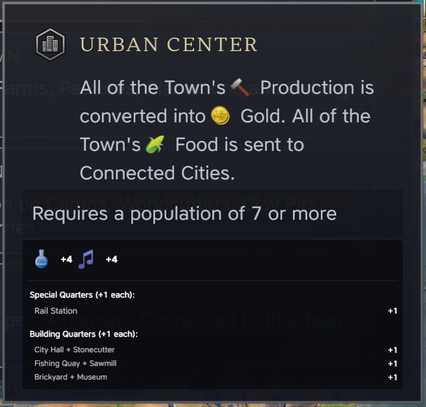
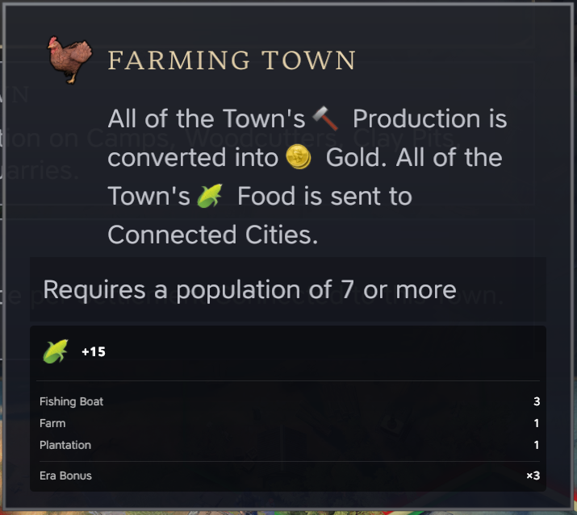
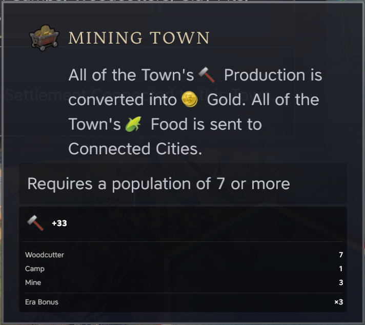
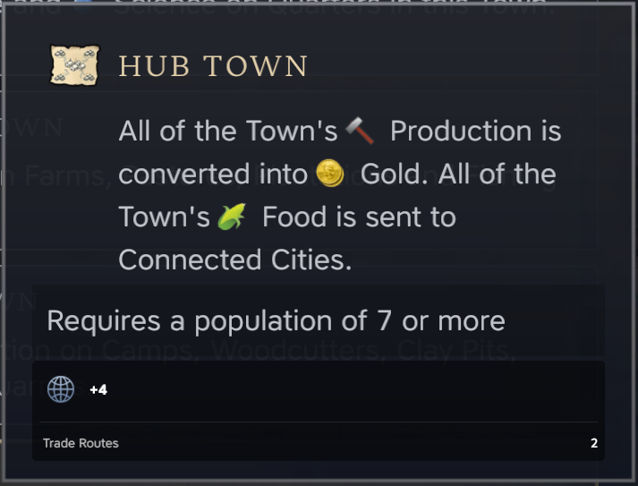

# Enhanced Town Focus Info Mod for Civilization VII

## Overview
Enhanced Town Focus Info is a quality-of-life mod for Civilization VII that provides detailed breakdowns of yield bonuses when selecting town specializations. This mod enhances the tooltip display to show exactly how many buildings, improvements, and trade routes contribute to each specialization's bonuses.

*Based on the original Town Focus Boost Info mod by Yamada, enhanced and maintained by Mallek*

## Features

### Urban Center Focus
Shows detailed breakdown of Science and Culture bonuses from:
- Special Quarters (like Rail Stations)
- Building Quarters (stacked buildings)
- Individual contribution of each quarter

### Farming Town Focus
Shows Food yield bonuses from:
- Farms
- Pastures
- Plantations
- Era multiplier bonuses (2x in Exploration Age, 3x in Modern Age)

### Mining Town Focus
Details Production bonuses from:
- Mines
- Woodcutters
- Quarries
- Clay Pits
- Camps
- Era multiplier effects (2x in Exploration Age, 3x in Modern Age)

### Hub Town Focus
Shows Diplomacy bonuses from:
- Domestic trade routes (+2 per route)
- Detailed route count and breakdown

## Installation
1. Subscribe to the mod through the Official Civilization VII Mod Browser
2. Enable the mod in the Additional Content menu
3. Start or load a game
4. Hover over any town focus option to see the enhanced tooltips

## Compatibility
- Works with Civilization VII base game
- Compatible with most other UI mods
- Does not affect save games

## Known Issues
- None currently reported

## Contributing
Feel free to contribute to this project by:
- Reporting bugs
- Suggesting improvements
- Submitting pull requests

## Credits
- Original mod concept by Yamada
- Enhanced and maintained by Mallek
- Thanks to the Civilization VII modding community

## License
This project is licensed under the MIT License - see the LICENSE file for details

## Version History
- 1.0.5: Initial release of Enhanced Town Focus Info
  - Complete rewrite of tooltip system
  - Added detailed breakdowns for all focus types
  - Improved visual presentation
  - Added era multiplier display
